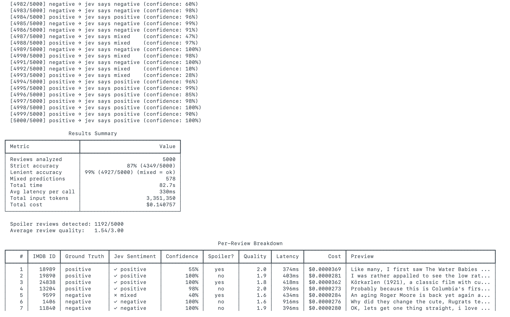

# jev-imdb-benchmark

> Can a non-LLM model understand movie reviews? Let's find out.

[Jev](https://typesafe.ai) is TypeSafe AI's **System One** model. It doesn't generate text — it classifies, routes, and scores, returning typed answers with calibrated probabilities in a single pass. This project benchmarks it against real IMDB reviews with known labels.

## Results

Jev analyzed **5,000** randomly sampled reviews from Stanford's [IMDB dataset](https://huggingface.co/datasets/stanfordnlp/imdb) (25K labeled reviews), balanced 50/50 positive/negative. Here's what happened:

| Metric | Value |
|---|---|
| Strict accuracy (exact match) | **87.0%** (4,349/5,000) |
| Lenient accuracy (mixed = ok) | **98.5%** (4,927/5,000) |
| Mixed predictions | 578 (11.6%) |
| Avg latency per call | **330ms** |
| P99 latency | 506ms |
| Total input tokens | 3,351,350 |
| Total cost | **$0.14** |

### Why two accuracy numbers?

IMDB labels are binary (positive/negative), but real reviews are often nuanced. Jev returned "mixed" for 578 reviews — ones that contained both praise and criticism. The actual wrong-polarity errors (positive ↔ negative) were only **73 out of 5,000** (1.5%).

### Confidence calibration

Jev knows when it doesn't know: correct predictions averaged **0.93** confidence, while wrong predictions averaged **0.63**.

| Class | Accuracy |
|---|---|
| Positive reviews | 87.0% (2,176/2,500) |
| Negative reviews | 86.9% (2,173/2,500) |

Full per-review breakdown with latency, cost, confidence, spoiler detection, quality scores, and the complete review text is saved to `results/` after each run.



## How it works

Each review is sent to Jev with three typed questions in a single `system_one()` call:

```python
questions = {
    "sentiment": Choice(...)    # positive / negative / mixed
    "is_spoiler": Noul(...)     # boolean probability
    "quality": Score(...)       # 1-3 scale
}
```

| Question type | What Jev returns |
|---|---|
| **Choice** | The best option + confidence + per-option probabilities |
| **Noul** | A probability (0.0 to 1.0) for a yes/no question |
| **Score** | A position on a scale + confidence + per-level probabilities |

## Quick start

```bash
git clone https://github.com/rahulbansalc6414/jev-imdb-benchmark.git
cd jev-imdb-benchmark

# Add your TypeSafe API key
cp .env.example .env
# Edit .env → TYPESAFE_API_KEY=your-key-here

# Run (default: 20 reviews)
uv run python main.py

# Or specify a sample size
uv run python main.py -n 5000
```

Get an API key at [console.typesafe.ai](https://console.typesafe.ai).

**Requirements:** Python 3.10+, [uv](https://docs.astral.sh/uv/)

## Project structure

```
main.py            # Entrypoint — loads IMDB data, runs concurrent loop
jev_analyzer.py    # Jev client + analyze_review()
display.py         # Rich terminal output + CSV export
test_display.py    # Tests for scoring logic and CSV output
results/           # CSV results and logs from runs
```

## Cost

Jev charges **$0.042 per million input tokens** with free output. A 5,000-review run costs ~$0.14. Requests run concurrently (20 workers), so 5,000 reviews finish in about 90 seconds.
